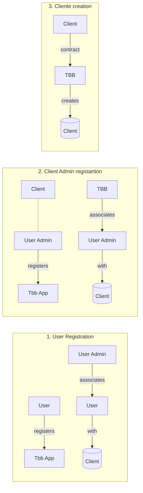

# core-final-project

## Motivación

Actualmente estoy desarrollando un proyecto junto con unos compañeros para la automatización del 
proceso de fermentación y maduración de la cerveza. Una parte de este proyecto consiste en una 
aplicación web para gestionar todo. En este proyecto se pretende alcanzar las funcionalidades 
mínimas de está aplicación

## Descripción del proyecto

Cada cliente tiene unos dispositivos físicos encargados de controlar temperatura y presión en los 
tanques de fermentación. Estos dispositivos se conectan a un servidor tanto para poder ser controlados 
y monitoreados remotamente, como para ir registrando métricas que luego se graficarán entre otras operaciones.

Este proyecto abarca el dashboard de cliente para administrar y monitorear los dispositivos. 
Y el dashboard para gestionar clientes y dispositivos.

En la aplicación de cliente se podrá visualizar dashboard de se mostrará todos los tanques con sus métricas 
y estado nn tiempo real. A parte habrá una serie de apartados para gestionar tanques, usuarios, dispositivos
relacionados con el cliente en cuestión.

En la application de propietario se mostrará los apartados para gestionar clientes, dispositivos y usuarios.

### Objetos de la aplicación

#### **Cliente**

Cada fabrica de cerveza que tiene comprados dispositivos

### **Usuario**

Cada una de las personas con acceso a la aplicación

#### **Tanques**

Deposito de facilita las condiciones para que se produzca el proceso de fermentación. Cualquier usuario podrá agregar o eliminar tantos tanques como desee. Ademas de modificar sus propiedades

#### **Dispositivo**

Artefactos encargados de controlar la temperatura y presión del tanque y que cuentan con una comunicación mqtt con el servidor. Los administradores pueden añadir, eliminar o modificar dispositivos. A cada usuario le aparecerán los dispositivos asociados y los podrás asociar a sus tanques.

## API

### Modelos

```yaml
- Client
    - name: String
    - address: String
    - city: String
    - zip: Number
    - country: String

- User
    - user_id: String
    - client_id: String
    - state: String ['pending', 'confirm', 'deny']

- Tank
    - alias: String
    - description: String
    - client_id: ObjectId('Client')

- Device
    - name: String
    - client_id: ObjectId('Client')

- DeviceTank
    - device_id: ObjectId('Device')
    - tank_id: ObjectId('Tank')
    - client_id: ObjectId('Client')

```

### API

- CRUD `Clients`

  - `GET /clients`: Lista de clientes
  - `GET /clients/:id`: Detalle de un clientes
  - `POST /clients`: Crea un clientes
  - `POST /clients/:id` Actualiza un clientes
  - `DELETE /clients/:id` Elimina un clientes

- Users
  - `GET /users`: Lista usuarios
  - `GET /users/:id`: Detalle de un usuario
  - `POST /users`: Crea un usuario
  - `POST /users/:id` Actualiza un usuario
  - `DELETE /users/:id` Elimina un usuario
- CRUD `Tanks`

  - `GET /tanks`: Lista de tanques
  - `GET /tanks/:id`: Detalle de un tanque
  - `POST /tanks`: Crea un tanque
  - `POST /tanks/:id` Actualiza un tanque
  - `DELETE /tanks/:id` Elimina un tanque

- CRUD `Devices`

  - `GET /device`: Lista de dispositivos
  - `GET /device/:id`: Detalle de un dispositivos
  - `POST /device`: Crea un dispositivos
  - `POST /device/:id` Actualiza un dispositivos
  - `DELETE /device/:id` Elimina un dispositivos

- HTTP `DeviceTank`
  - `GET /device-tank` Get link between a device and a tank
  - `PUT /device-tank` Create link between a device and a tank
  - `DELETE /device-tank` Delete link between a device and a tank

## Registration flow



## Front
